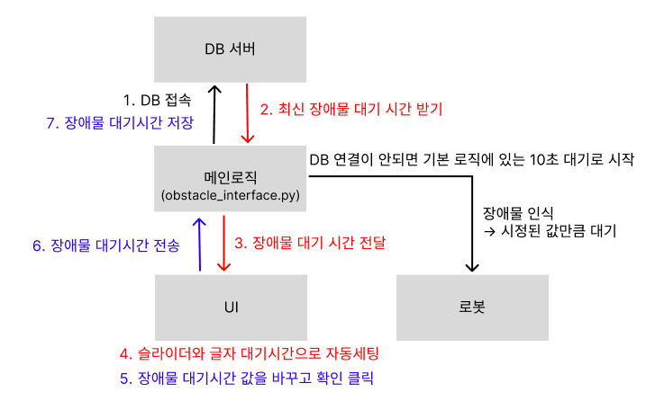

## 장애물 감지 가이드 (메인 로직 02용)
### 1. 패키지 구조
장애물 판단 핵심 노드와 UI 연동을 위한 인터페이스가 포함되어 있습니다. <br>
```bash
AI_Robot_Final_Project/
└── src/
    └── logic2_pkg/
        ├── config/
        │   └── twist_mux.yaml        # [중요] cmd_vel 우선순위 설정
        ├── launch/
        │   └── obstacle.launch.py    # [수정 필요] 노드 통합 실행 스크립트
        ├── logic2_pkg/
        │   ├── obstacle_node.py      # 장애물 감지 및 회피 핵심 로직
        │   └── obstacle_interface.py # UI-노드-DB 간 데이터 중재 클래스
        └── setup.py                  # 엔트리 포인트 설정
```
### 2. 주행 우선 순위 설정 (twist_mux)
여러 노드에서 발행되는 속도 명령(cmd_vel)의 충돌을 방지하기 위해 twist_mux를 통한 우선순위 적용 <br>
모든 제어 명령은 `/cmd_vel`로 발행하지 않고 아래 **지정된 토픽을 사용**해야 합니다.<br>
(예: `/cmd_vel_obstacle`) <br>
**우선순위 계층 구조** <br>
| 순위 | 토픽 명칭 | 우선순위 값 | 비고 |
| :--- | :--- | :--- | :--- |
| 1 | `/cmd_vel_obstacle` | 100 | 장애물 감지 시 강제 정지/우회 (최우선) |
| 2 | `/cmd_vel_teleop` | 10 | UI 수동 조작 명령 |
| 3 | `/cmd_vel_nav` | 5 | Navigation2 자율 주행 명령 |


### 3. 시스템 실행 방법
**A. twist_mux 및 장애물 노드 실행** <br>
  ```bash
  # 우선 순위 믹서 실행 (빌드 및 소싱 필수)
  ros2 run twist_mux twist_mux --ros-args --params-file ./src/logic2_pkg/config/twist_mux.yaml -r cmd_vel_out:=cmd_vel
  ```
  ```bash

  # 장애물 감지 노드 실행 (별도 터미널)
  ros2 run logic2_pkg obstacle_node
  ```
**B. 시스템 정상 작동 확인** <br>
터미널에서 모든 제어 명령이 twist_mux를 거쳐 최종적으로 /cmd_vel로 합쳐지는지 확인합니다.
  ```bash
  ros2 topic list | grep cmd_vel
  ```
[출력 항목]<br>
`/cmd_vel_obstacle` (입력1)<br>
`/cmd_vel_teleop` (입력2)<br>
`/cmd_vel_nav` (입력3)<br>
`/cmd_vel` (최종 출력)<br>

### 4. 장애물 감지 로직 상세 (수정 필요)
- 감지 범위: 전방 60도(-30도 ~ +30도), 거리 0.35m 이내 장애물 감지 시 즉시 정지.
- 가변 대기 시간: UI 슬라이더를 통해 obstacle_wait_time 파라미터를 실시간으로 변경 가능(기본 10초).
- 자동 우회: 설정된 대기 시간이 지나면 로봇은 자동으로 제자리 회전(1.0 rad/s)을 2초간 수행하여 탈출 시도.

### 5. 시스템 아키텍처 및 데이터 흐름도
장애물 인식 대기 시간 설정 시, UI-메인로직-로봇-DB 서버 간의 상호작용 및 예외 처리 흐름은 다음과 같습니다.


**[설계 핵심 요약]** <br>
1. **Initial Sync**: 부팅 시 DB로부터 최신값을 수신하여 UI와 로봇 노드에 배포
2. **Real-time Update**: UI 조작 시 로봇 파라미터와 DB 기록을 동시 수행
3. **Fail-safe**: DB 미연결 시 로컬 기본값(10s) 사용 및 연결 복구 시 누락 데이터 자동 전송

### 6. UI 실시간 파라미터 제어 (ObstacleInterface)
UI 파트에서 파이썬 함수만으로 대기 시간을 수정할 수 있도록 ObstacleInterface를 제공

**A. 주요 특징 (Self-healing)** <br>
- 부팅 시 동기화: DB 연결 시 최신 설정값을 로드하여 로봇에 즉시 주입합니다.
- 자동 재시도: DB 연결이 끊긴 상태에서 설정 변경 시, 로봇에는 즉시 반영하되 실패한 데이터는 `pending_data`에 보존합니다. 이후 10초 주기 타이머가 작동하여 DB 복구 시 자동으로 누락 데이터를 업데이트합니다.

**B. 파이썬 API 사용법** <br>
`RobotLogicHandler`클래스(`robot_logic.py`)에서 아래와 같이 객체를 생성하여 연결합니다.
```python
from logic2_pkg.obstacle_interface import ObstacleInterface

class RobotLogicHandler:
    def __init__(self, ui_instance):
        self.ui = ui_instance

        # ---- 장애물 제어 인터페이스 객체 생성 ----
        self.obstacle_manager = ObstacleInterface()
        self._setup_connections()
        self._load_initial_data()

    def _load_initial_data(self):
        """앱 시작 시 DB의 마지막 값을 UI 슬라이더에 초기화"""
        # DB 연결 상태에 따라 가져온 최신값(또는 기본값)을 변수에 저장
        init_val = self.obstacle_manager.current_wait_time
        # TODO: UI 슬라이더 객체명에 맞춰 setValue 호출
        # self.ui.obstacleSlider.setValue(init_val)
        print(f"[INIT] 장애물 대기시간 초기값 {init_val}초 세팅 완료")

    def on_obstacle_set(self, val):
        """UI 슬라이더 조작 후 [확인] 클릭 시 실행되는 콜백"""
        # 로봇 전송 + DB 저장 일괄 처리 함수 호출 + 누락 데이터 자동 저장 예약
        success, msg = self.obstacle_manager.update_db_and_sync(val)
        # 로그 출력 및 필요 시 UI 상태줄에 메시지 표시
        print(f"[LOGIC] {msg}")

```

### 7. 문제 해결
**A. 장애물 앞에서 멈추지 않을 때** <br>
- 토픽 확인: 노드가 `/cmd_vel`이 아닌 `/cmd_vel_obstacle`로 발행 중인지 확인하세요.
- 센서 값: `ros2 topic echo /scan`으로 라이다 데이터가 정상 수신되는지 확인하세요.

**B. UI에서 설정값을 바꿨는데 로봇이 그대로일 때** <br>
- `obstacle_node`가 현재 실행 중인지 확인하세요.
- `ros2 param get /obstacle_node obstacle_wait_time` 명령어로 파라미터 반영 여부를 확인하세요.

**C. DB 저장 실패 로그가 뜰 때** <br>
- 네트워크 상태: 서버와의 연결을 확인하세요. 인터페이스 내부에 자동 재시도 로직이 포함되어 있어 연결 복구 시 자동으로 해결됩니다.
