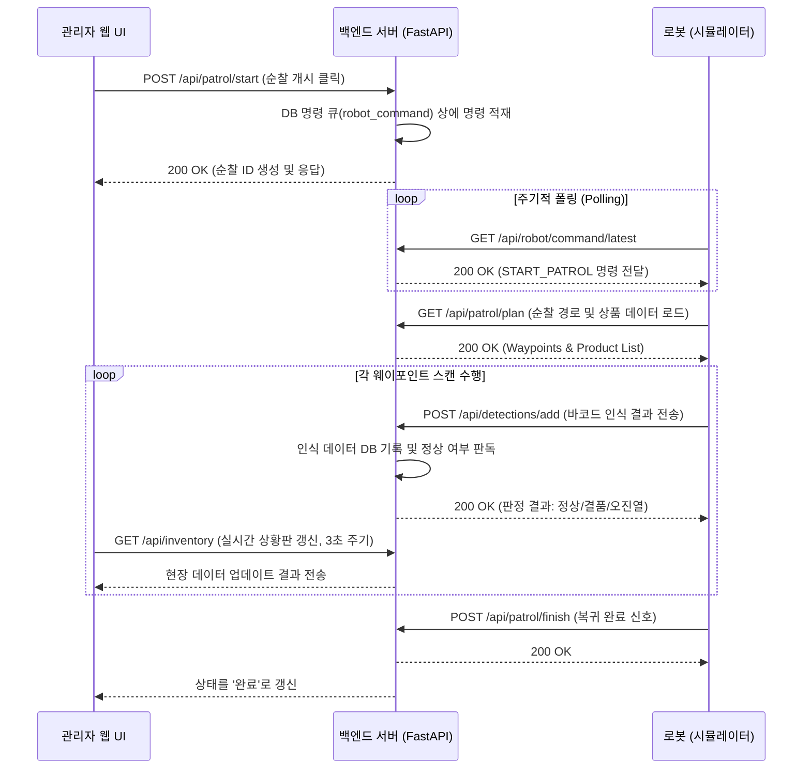

# 🤖 Gilbot 시스템 관리 가이드 (System Management Guide)

이 문서는 Gilbot(편의점 매대 관리 로봇) 시스템의 기동, 연결 확인 및 통합 관리 방법을 설명합니다.

---

## 1. 시스템 구성 개요

Gilbot 시스템은 다음과 같은 4가지 핵심 컴포넌트로 구성됩니다:

1.  **데이터베이스 (DB Server)**: MySQL/MariaDB를 사용하여 상품 마스터 정보, 순찰 로그, 이상 감지 내역을 저장합니다.
2.  **백엔드 서버 (Web Server)**: FastAPI(Python) 기반으로 API 서비스를 제공하며, 로봇과 웹 UI 사이의 가교 역할을 합니다.
3.  **관리자 웹 UI (Web UI)**: React 기반의 상황판으로, 실시간 모니터링 및 상품/위치 관리 기능을 제공합니다.
4.  **로봇/인식 서버 (Robot/Image Simulator)**: 로봇의 물리적 동작(또는 시뮬레이션)과 이미지 인식을 통한 결품/오진열 판독을 수행합니다.

---

## 2. 서비스 기동 순서 (Start-up Sequence)

시스템의 안정적인 연결을 위해 다음 순서대로 서비스를 기동하십시오.

### **Step 1: 데이터베이스 서버 확인 (Lightsail Remote DB)**
-   AWS Lightsail 서버의 MySQL 서비스가 정상인지 확인합니다.
-   `web-server/.env` 파일의 설정(`DB_HOST=16.184.56.119`)이 원격 서버 주소와 일치하는지 확인하십시오.
-   현재 로컬 개발 환경에서도 Lightsail의 통합 DB를 바라보도록 설정되어 있습니다.

### **Step 2: 백엔드 API 서버 기동**
웹 서버는 모든 통신의 중심입니다.
```bash
cd /home/robot/final_ws/AI_Robot_Final_Project202603/web-server
# 가상환경 활성화 (필요 시)
# source venv/bin/activate
python main.py
```
-   **API 주소**: `http://localhost:8000` (Local 구동 시)
-   **연동 DB**: `16.184.56.119` (AWS Lightsail)
-   **정상 확인**: 브라우저에서 `http://localhost:8000/api/status` 접속 시 `"database": "connected"` 확인.

### **Step 3: 관리자 웹 UI 기동**
직관적인 모니터링을 위해 프론트엔드를 실행합니다.
```bash
cd /home/robot/final_ws/AI_Robot_Final_Project202603/web-ui
npm run dev
```
-   **기본 포트**: `5173`
-   **정상 확인**: 대시보드 상단 로고 옆 `DB Connected` 녹색 상태 등을 확인하십시오.

### **Step 4: 로봇 및 이미지 인식 서버 연결**
로봇(또는 시뮬레이터)을 실행하여 서버와 통신을 시작합니다.
```bash
cd /home/robot/final_ws/AI_Robot_Final_Project202603/web-server
python simulate_robot.py
```
-   **핵심 설정**: `simulate_robot.py` 상단의 `BASE_URL`이 백엔드 서버 주소와 맞는지 확인하십시오. (로컬이면 `http://localhost:8000`)
-   **연동 환경**: 로컬 로봇이 중앙 Lightsail DB의 상품 계획을 읽어와 동작합니다.

---

## 3. 통신 및 연결 상태 관리

### **연결 확인 (Health Check)**
-   **웹 UI 사이드바**: 왼쪽 상단의 `Robot Online/Offline` 및 `DB Connected` 표시등을 통해 실시간 장애 여부를 파악할 수 있습니다.
-   **로봇 폴링 (Polling)**: 로봇 시뮬레이터는 2초 간격으로 서버의 명령 큐를 확인합니다. 서버가 꺼지면 시뮬레이터 터미널에 연결 오류가 표시됩니다.

### **명령 하달 (Command Flow)**
1.  **웹 UI**에서 '순찰 개시' 클릭.
2.  **백엔드**의 `robot_command` 테이블에 `START_PATROL` 명령 적재.
3.  **로봇**이 다음 폴링 주기에 명령 수신 후 동작 시작.
4.  **로봇**이 인식한 이미지 결과(바코드 등)를 백엔드 `/api/detections/add`로 전송.
5.  **웹 UI** 상황판에 실시간 결과 업데이트.

---

## 4. 모니터링 및 운영 방법

### **관리 업무 (Daily Operations)**

| 항목 | 기능 | 설명 |
| :--- | :--- | :--- |
| **관제상황판** | 실시간 감시 | 현재 로봇의 위치, 최근 순찰 결과, 미해결 알림 수 확인 |
| **매대 현황 시각화** | 결품/오진열 파악 | 특정 구역/단에 어떤 상품이 잘못 놓였는지 색상별로 확인 |
| **이상 탐지 알림** | 조치 완료 처리 | 🚨 알림 발생 시 현장 조치 후 웹 UI에서 '조치 완료' 버튼 클릭 |
| **상품 리스트 관리** | 제품 정보 수정 | 신규 상품 입고 시 바코드 및 최소 유지 수량 설정 |
| **순찰 계획 설정** | 위치-상품 매핑 | 어떤 웨이포인트(태그)에 어떤 상품이 진열되어야 하는지 경로 설정 |

---

## 5. 장애 대응 (Troubleshooting)

1.  **로봇이 명령에 반응하지 않을 때**:
    -   `main.py` 서버가 가동 중인지 확인하십시오.
    -   로봇 시뮬레이터 터미널에서 `BASE_URL` 연결 오류가 뜨지 않는지 확인하십시오.
2.  **데이터가 업데이트되지 않을 때**:
    -   관리자 웹 UI 왼쪽 상단의 **DB 연결 상태**가 `connected`인지 확인하십시오.
    -   `web-server/main.log` 파일을 열어 SQL Query 오류 여부를 체크하십시오.
3.  **인식 결과가 나오지 않을 때**:
    -   `simulate_robot.py` (또는 실제 AI 서버)에서 `POST /detections/add` 요청에 대한 응답 코드가 `200`인지 확인하십시오.

---

## 6. API 및 시뮬레이터 주요 함수 인터페이스 (API & Function Interface)

로봇 시뮬레이터(`simulate_robot.py`)와 백엔드 서버(`main.py`)가 어떻게 통신하고 데이터를 교환하는지 상세히 기술합니다.

### **시뮬레이터 주요 함수 (Robot Simulator Logic)**

시뮬레이터는 서버로부터 설정을 동기화하고, 명령을 수행하며, 감지 결과를 실시간으로 보고합니다.

| 함수 | 역할 | 호출 방식 및 로직 |
| :--- | :--- | :--- |
| **`load_memory()`** | 설정 및 경로 동기화 | 서버의 `/api/patrol/config`, `/api/patrol/plan`, `/api/products` API를 호출하여 최신 환경 정보를 로봇 메모리에 탑재합니다. |
| **`poll_commands()`** | 원격 명령 수신 | 2초 간격으로 서버의 `/api/robot/command/latest`를 조회(Polling)하여 `START_PATROL`, `EMERGENCY_STOP` 등의 명령이 있는지 확인합니다. |
| **`start_patrol()`** | 순찰 시나리오 수행 | 순찰 상태를 시작하고 서버에 시작 신호를 보낸 뒤, `load_memory`로 가져온 웨이포인트 경로를 따라 이동 및 스캔을 시뮬레이션합니다. |
| **`send_detection()`** | 인식 결과 보고 | 스캔된 태그와 인식된 상품 정보를 서버의 `/api/detections/add` 경로로 전송하여 DB에 기록하고 판독하도록 요청합니다. |
| **`emergency_stop()`**| 비상 정지 처리 | 현재 진행 중인 모든 동작을 중단하고 서버에 비상 정지 상태를 보고합니다. |

---

### **서버 측 API 엔드포인트 (Back-end API usage)**

로봇 및 시뮬레이터가 연동하는 주요 엔드포인트 목록입니다.

| 엔드포인트 | Method | 담당 기능 | 데이터 예시 |
| :--- | :--- | :--- | :--- |
| **`/api/status`** | GET | 서버 및 DB 연결 상태 확인 | `{ "status": "running", "database": "connected" }` |
| **`/api/robot/command/latest`**| GET | 대기 중인 로봇 명령 조회 | `{ "command_id": 12, "command_type": "START_PATROL" }` |
| **`/api/detections/add`** | POST | 상품 인식 데이터 전송 및 판정 | **In**: `{ "tag_barcode": "T001", "detected_barcode": "8801..." }` <br> **Out**: `{ "judgment": "정상/결품/오진열" }` |
| **`/api/patrol/start`** | POST | 순찰 시작 로그 생성 | `{ "message": "Success", "patrol_id": 105 }` |
| **`/api/patrol/finish`** | POST | 순찰 완료 처리 및 기지 복귀 | `{ "message": "Patrol finished successfully" }` |
| **`/api/robot/command/{id}/complete`**| POST | 수행된 명령 완료 처리 | 시뮬레이터가 명령을 받은 후 완료되었음을 서버에 알림 |

---

### **통신 시퀀스 (Communication Workflow)**

아래 다이어그램은 사용자가 웹 UI에서 순찰 명령을 내렸을 때 시스템 전체에서 발생하는 통신 흐름을 보여줍니다.



---

> **연동 시 주의사항**: Gilbot 프로젝트는 이제 **Lightsail 중앙 DB(`16.184.56.119`) 하나만을 바라봅니다.** 로컬에서 `main.py`나 `simulate_robot.py`를 실행하더라도 데이터는 Lightsail에서 관리되므로, 로컬 MySQL 서버를 별도로 기동할 필요가 없습니다. 시뮬레이터의 `BASE_URL` 설정은 로컬일 경우 `localhost:8000`으로, 전체 원격 모드일 경우 `http://16.184.56.119/api`로 맞춰주면 됩니다.
