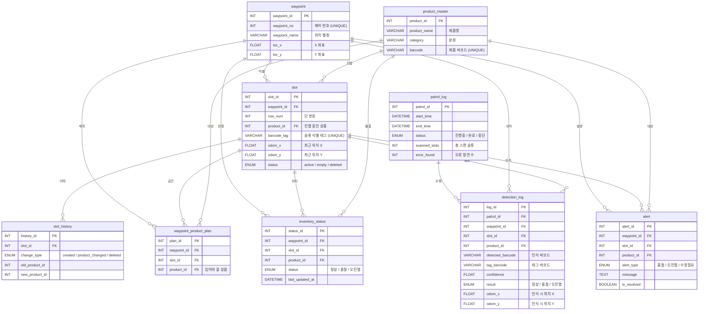

# 📊 ERD — gilbot DB

> **프로젝트:** 편의점 매대 관리 로봇  
> **DB명:** `gilbot`  
> **서버:** Amazon Lightsail `16.184.56.119`  
> **스키마 버전:** v3.1 (단순 상태 관리 모델)  
> **작성일:** 2026-03-27  
> **작성자:** DB/WEB 파트  

---

## 설계 원칙

> ⚠️ **v3.1 개정 주요 변경사항**
> - **수량 관리 폐기**: 로봇의 물리적 한계를 고려하여 '개수' 대신 **'상태(정상/품절/오진열)'**에만 집중
> - **위치 정보 최적화**: `slot` 테이블에서 불필요한 `col_num`(열 번호) 제거 (바코드 태그가 위치를 대체)
> - **상태값 한글화**: `inventory_status`, `detection_log` 등의 결과값을 직관적인 한글(`정상`, `품절`, `오진열`)로 변경

| 테이블 | 역할 |
|---|---|
| `product_master` | 외부 재고관리 DB에서 필요한 필드만 **동기화 캐시** |
| `waypoint` | 로봇이 물리적으로 **정지하여 스캔하는 위치** (X/Y 좌표 기반) |
| `slot` | 매대 하단 바코드/QR 태크로 식별되는 **개별 진열 공간** |
| `waypoint_product_plan` | 특정 슬롯에 **어떤 상품이 있어야 하는지** 정의하는 마스터 정보 |
| `inventory_status` | 순찰 후 최종적으로 파악된 **슬롯별 현재 상태** |
| `patrol_log` | 순찰 회차별 결과 통계 (스캔 수, 오류 발견 수 등) |
| `detection_log` | 순찰 중 발생하는 **모든 인식 이력** (바코드, odom, 신뢰도 등) |
| `alert` | 품절/오진열 등 즉각적인 조치가 필요한 **알림 정보** |
| `slot_history` | 슬롯의 생성 및 상품 변경 이력 추적 |

---

## 로봇 운영 프로세스

1.  **Waypoint 도착**: 로봇이 미리 정의된 정지 위치(X, Y)에 멈춤
2.  **Tag 스캔**: 매대 하단의 **바코드 태그**를 읽어 어떤 `slot`인지 식별
3.  **Product 스캔**: 슬롯에 놓인 **상품 바코드**를 읽어 `product_id` 확인
4.  **결과 판독**:
    - **정상**: `plan`의 상품과 `detected` 상품이 일치
    - **품절**: 상품 바코드가 읽히지 않음
    - **오진열**: `plan`과 다른 상품 바코드가 읽힘
5.  **DB 기록**: `detection_log`에 모든 시도 기록 및 `inventory_status` 최신화

---

## ERD 다이어그램



---

## JSON 데이터 스펙 (v3.1)

```json
{
  "patrol_id": 10,
  "waypoint_id": 5,
  "slot_id": 24,
  "tag_barcode": "TAG-S1-R2",
  "detected_barcode": "8801111222233",
  "product_id": 15,
  "confidence": 0.98,
  "result": "정상",
  "odom_x": 2.45,
  "odom_y": 1.12,
  "timestamp": "2026-03-27T10:00:00"
}
```
