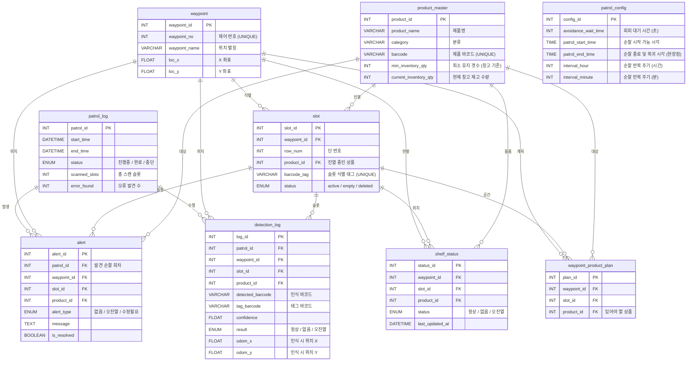

# 📊 ERD — gilbot DB

> **프로젝트:** 편의점 매대 관리 로봇
> **DB명:** `gilbot`
> **서버:** Amazon Lightsail `16.184.56.119`
> **스키마 버전:** v3.1 (단순 상태 관리 모델)
> **작성일:** 2026-03-27
> **작성자:** DB/WEB 파트

---

## 설계 원칙

> ⚠️ **v3.1 개정 주요 변경사항**
> - **수량 관리 폐기**: 로봇의 물리적 한계를 고려하여 '개수' 대신 **'상태(정상/없음/오진열)'**에만 집중
> - **위치 정보 최적화**: `slot` 테이블에서 불필요한 `col_num`(열 번호) 제거 (바코드 태그가 위치를 대체)
> - **상태값 한글화**: `shelf_status`, `detection_log` 등의 결과값을 직관적인 한글(`정상`, `없음`, `오진열`)로 변경

| 테이블 | 역할 |
|---|---|
| `product_master` | 외부 재고관리 DB에서 필요한 필드만 **동기화 캐시** |
| `waypoint` | 로봇이 물리적으로 **정지하여 스캔하는 위치** (X/Y 좌표 기반) |
| `slot` | 매대 하단 바코드/QR 태크로 식별되는 **개별 진열 공간** |
| `waypoint_product_plan` | 특정 슬롯에 **어떤 상품이 있어야 하는지** 정의하는 마스터 정보 |
| `shelf_status` | 순찰 후 최종적으로 파악된 **슬롯별 현재 진열 상태** |
| `patrol_log` | 순찰 회차별 결과 통계 (스캔 수, 오류 발견 수 등) |
| `detection_log` | 순찰 중 발생하는 **모든 인식 이력** (바코드, odom, 신뢰도 등) |
| `alert` | 없음/오진열 등 즉각적인 조치가 필요한 **알림 정보** |
| `patrol_config` | 로봇 운영 설정 (대기시간, 스케줄, 인터발 등) |

---

## 로봇 운영 프로세스

1.  **Waypoint 도착**: 로봇이 미리 정의된 정지 위치(X, Y)에 멈춤
2.  **Tag 스캔**: 매대 하단의 **바코드 태그**를 읽어 어떤 `slot`인지 식별 (위치 매칭)
3.  **이미지 서버 YOLO 판독**: 로봇이 전송한 이미지를 **이미지 서버**에서 **YOLO**로 인식 → 실제 상품의 바코드를 읽는 대신, 외형 기반으로 바코드 ID를 식별하여 DB로 전달
4.  **결과 비교 및 판독**:
    - **정상**: 계획된 상품 바코드와 인식된 바코드 ID 일치
    - **없음**: 해당 위치에 상품이 인식되지 않음 (Display Empty)
    - **오진열**: 계획과 다른 바코드 ID가 인식됨 → **이미지 서버가 전송한 실물 ID를 `alert`에 기록**
5.  **DB 기록**: `detection_log`에 판독 결과 기록 및 `shelf_status` 현재 상태 갱신

---

## ERD 다이어그램



---

## JSON 데이터 스펙 (v3.1)

```json
{
  "patrol_id": 10,       // 어느 순찰 회차인지 (로봇이 고정값 전송)
  "waypoint_id": 5,     // 로봇이 현재 위치한 Waypoint 고유 ID
  "tag_barcode": "TAG-S1-R2", // 이미지 서버가 읽어낸 매대 하단 슬롯 식별 태그 (핵심 식별자)
  "detected_barcode": "8801111222233", // YOLO가 인식한 상품 바코드/ID (실물)
  "product_id": 15,      // 이미지 서버 내부 DB 매칭 결과 (선택 사항)
  "confidence": 0.98,    // 판독 신뢰도
  "result": "정상",      // 최종 위치 판독 결과 (정상/없음/오진열)
  "odom_x": 2.45,        // 인식 시점 로봇 좌표 X
  "odom_y": 1.12,        // 인식 시점 로봇 좌표 Y
  "timestamp": "2026-03-27T10:00:00"
}
```
