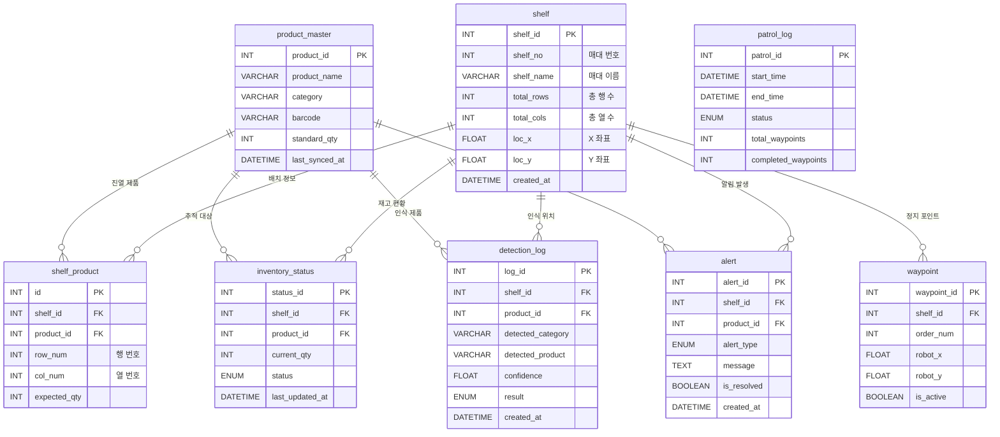

# 📊 ERD — gilbot DB

> **프로젝트:** 편의점 매대 관리 로봇  
> **DB명:** `gilbot`  
> **서버:** Amazon Lightsail `16.184.56.119`  
> **작성일:** 2026-03-24  
> **작성자:** DB/WEB 파트  

---

## 설계 원칙

| 테이블 | 역할 |
|---|---|
| `product_master` | 외부 재고관리 DB에서 필요한 필드만 **동기화 캐시** (직접 접근 불가 대응) |
| `shelf` | 매대/진열대 위치 좌표 (로봇 waypoint와 연결) |
| `shelf_product` | 매대-제품 배치 매핑 (어느 매대에 어떤 제품이 있어야 하는가) |
| `inventory_status` | 로봇 인식 결과 기반 **실시간 재고 현황** (최신화 방식) |
| `detection_log` | 매 인식마다 쌓이는 이력 로그 (inventory_status와 분리) |
| `waypoint` | 순찰 경로상 각 매대 로봇 정지 위치 |
| `patrol_log` | 순찰 회차 기록 (시작/종료/완료 웨이포인트 수) |
| `alert` | 재고 부족 / 품절 / 이상 감지 알림 |

---

## ERD 다이어그램



---

## 외부 재고 DB 연동 전략

```
[외부 재고관리 DB] (접근 불가)
  제품명, 종류, 바코드, 기준수량 등
          ↓  sync_product.py (수동 or 주기 실행)
[gilbot DB - product_master 테이블]
  캐시로 저장 → robot / web 시스템이 이를 참조
```

**동기화 방법 (우선순위):**
1. 관리자가 CSV로 내보내기 → `sync_product.py`로 import
2. (가능하다면) 외부 DB API 호출 → 자동 동기화

---

## JSON 전송 스펙 (로봇 → 웹 서버)

```json
{
  "shelf_id": 1,
  "product_id": 42,
  "detected_category": "snack",
  "detected_product": "포카칩 오리지널",
  "confidence": 0.94,
  "result": "있다",
  "timestamp": "2026-03-24T12:00:00"
}
```

---

## CREATE TABLE SQL

전체 SQL은 [`create_tables.sql`](./create_tables.sql) 파일 참조
