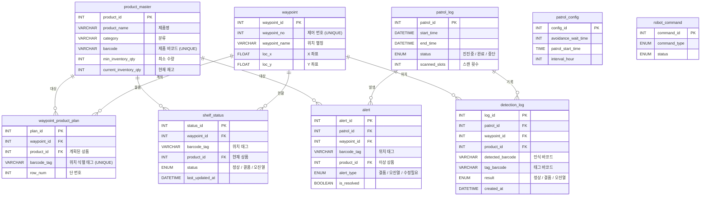

# 📊 ERD — gilbot DB

> **프로젝트:** 편의점 매대 관리 로봇
> **DB명:** `gilbot`
> **서버:** Amazon Lightsail `16.184.56.119`
> **스키마 버전:** v3.2 (슬롯 방식 완전 제거 및 바코드 태그 기반 통합 모델)
> **작성일:** 2026-03-30
> **작성자:** DB/WEB 파트

---

## 설계 원칙

> ⚠️ **v3.2 개정 주요 변경사항**
> - **Legacy 제거**: 더 이상 사용되지 않는 `shelf`, `slot`, `shelf_product` 테이블 및 관련 필드(`slot_id`) 완전 삭제
> - **바코드 태그 기반**: 모든 위치 식별은 `waypoint_id`와 `barcode_tag`의 조합으로 수행함

| 테이블 | 역할 |
|---|---|
| `product_master` | 상품 정보 및 창고 재고 마스터 정보 |
| `waypoint` | 로봇이 물리적으로 **정지하여 스캔하는 위치** (X/Y 좌표 기반) |
| `waypoint_product_plan` | 특정 위치(웨이포인트 + 바코드 태그)에 **어떤 상품이 있어야 하는지** 정의 |
| `shelf_status` | 순찰 후 최종적으로 파악된 **현재 진열 상태** |
| `patrol_log` | 순찰 회차별 기록 및 로봇 현재 상태(순찰중/휴식중/비상정지) 관리 |
| `detection_log` | 순찰 중 발생하는 **모든 인식 이력** |
| `alert` | 결품/오진열 등 즉각적인 조치가 필요한 **알림 정보** |
| `patrol_config` | 로봇 운영 설정 (대기시간, 스케줄 등) |
| `robot_command` | 로봇 원격 제어 명령 큐 |

---

## 로봇 운영 프로세스

1.  **Waypoint 도착**: 로봇이 미리 정의된 정지 위치(X, Y)에 멈춤
2.  **Tag 스캔**: 매대의 **바코드 태그**를 읽어 위치를 식별
3.  **이미지 서버 분석**: YOLO를 통해 실제 상품의 바코드 식별 데이터 수신
4.  **판독 및 기록**:
    - `waypoint_product_plan`의 계획된 상품과 대조
    - `shelf_status` 최신화 및 `detection_log` 기록
    - 이상 발견 시 `alert` 생성

---

## ERD 다이어그램

