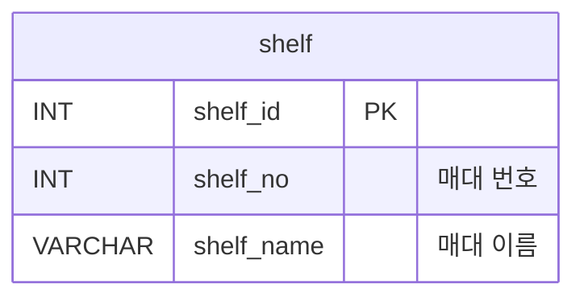

# 🗺️ ERD 보는 법 가이드

> **대상 파일:** [`erd.md`](./erd.md)  
> **사용 도구:** VSCode + Mermaid 플러그인

---

## 1. 플러그인 설치

### VSCode Extensions에서 설치
1. `Ctrl+Shift+X` → Extensions 열기
2. **`mermaid`** 검색
3. **"Markdown Preview Mermaid Support"** (`bierner.markdown-mermaid`) 설치

### 터미널에서 설치
```bash
code --install-extension bierner.markdown-mermaid
```

---

## 2. ERD 미리보기

1. `erd.md` 파일 열기
2. `Ctrl+Shift+V` → Markdown 미리보기 창 열기
3. 미리보기 창에서 ERD 다이어그램이 자동 렌더링됨

> 💡 **Tip:** 편집창과 미리보기를 나란히 보려면  
> `Ctrl+K V` 단축키 사용

---

## 3. Mermaid ERD 표기법 읽는 법

### 3-1. 테이블(Entity) 구조

```
테이블명 {
    타입  컬럼명  키타입  "설명"
}
```

**예시:**


| 기호 | 의미 |
|---|---|
| `PK` | Primary Key (기본키) |
| `FK` | Foreign Key (외래키) |
| `INT` | 정수형 |
| `VARCHAR` | 문자열 |
| `FLOAT` | 실수형 |
| `DATETIME` | 날짜+시간 |
| `ENUM` | 열거형 (정해진 값만 허용) |
| `BOOLEAN` | 참/거짓 |

---

### 3-2. 관계선(Relationship) 읽는 법

```
테이블A  관계  테이블B : "관계설명"
```

#### 관계 기호표

| 기호 | 의미 | 예시 |
|---|---|---|
| `\|\|` | 정확히 1 | 반드시 1개 |
| `o\|` | 0 또는 1 | 없거나 1개 |
| `\|{` | 1 이상 | 1개 이상 |
| `o{` | 0 이상 | 없거나 여러 개 |

#### 자주 쓰는 조합

| 표기 | 읽는 법 | 뜻 |
|---|---|---|
| `\|\|--o{` | 일 대 다 | 1개 ↔ 0개 이상 |
| `\|\|--\|\|` | 일 대 일 | 1개 ↔ 1개 |
| `o{--o{` | 다 대 다 | 여러 개 ↔ 여러 개 |

#### 예시 해석

```
shelf ||--o{ shelf_product : "배치 정보"
```
> **매대(shelf) 1개**는 **진열 정보(shelf_product) 0개 이상**을 가질 수 있다.  
> = 하나의 매대에 여러 제품이 배치될 수 있음

```
product_master ||--o{ inventory_status : "추적 대상"
```
> **제품(product_master) 1개**는 **재고 현황(inventory_status) 0개 이상**을 가질 수 있다.  
> = 한 제품의 재고 현황이 여러 매대에 걸쳐 기록될 수 있음

---

## 4. gilbot DB 테이블 한눈에 보기

```
[외부 재고 DB]
      ↓ 동기화
product_master ─────────────────────────────┐
      │ (제품 정보)                          │
      ├──→ shelf_product (행/열 위치 매핑)  │
      │         ↑                            │
shelf ──────────┘                            │
  │   (매대 번호, 좌표)                     │
  ├──→ inventory_status (실시간 재고 현황) ←┤
  ├──→ detection_log (인식 로그)            │
  ├──→ waypoint (순찰 정지 위치)            │
  └──→ alert (재고 알림) ←─────────────────┘

patrol_log (순찰 기록 — 독립)
```

---

## 5. 위치 좌표 개념

### 매대(shelf) 위치 — 로봇 기준 좌표
```
  Y
  ↑
  │   [매대2]  [매대3]
  │   [매대1]
  └──────────────→ X
        (로봇 시작점)
```
- `loc_x`, `loc_y` : 로봇이 해당 매대 앞에 멈출 위치 (미터 단위)

### 매대 내 제품 위치 — 행/열
```
       열1    열2    열3    열4
행1  [포카칩][새우깡][홈런볼][   빈칸  ]
행2  [콜라  ][사이다][   빈칸   ][오렌지주스]
행3  [   빈칸   ][맥주  ][   빈칸   ][   빈칸   ]
```
- `row_num` : 행 번호 (위에서 아래, 1부터)
- `col_num` : 열 번호 (왼쪽에서 오른쪽, 1부터)

---

## 6. 관련 파일

| 파일 | 설명 |
|---|---|
| [`erd.md`](./erd.md) | ERD 다이어그램 및 설계 원칙 |
| [`create_tables.sql`](./create_tables.sql) | MySQL 테이블 생성 SQL |
| [`how_to_view_erd.md`](./how_to_view_erd.md) | 이 파일 |
