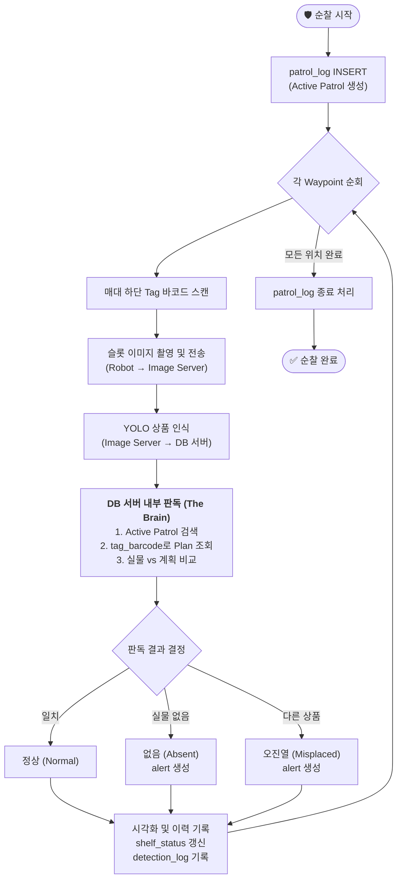

# 🔄 순찰 판독 및 상태 업데이트 로직 (Brain-in-DB Model)

> **연관 파일:** [`erd.md`](./erd.md) | [`create_tables.sql`](./create_tables.sql)  
> **작성일:** 2026-03-27

---

## 1. 개요

본 시스템은 **DB 서버를 '두뇌'**로 활용합니다. 이미지 서버(YOLO)는 오직 현장에서 본 원시 데이터(Raw Data)만 전달하며, 모든 판독(`정상/없음/오진열`)과 상태 결정은 DB 서버에서 중앙 집중적으로 처리합니다.

---

## 2. 전체 흐름도



---

## 3. 웹 서버 처리 로직 (Python 의사코드)

```python
def process_scan_result(tag_barcode, detected_barcode):
    """
    이미지 서버에서 YOLO 인식 정보(바코드)를 던졌을 때 DB 서버가 수행하는 판독 로직
    """
    # 1. '뇌(DB)'가 현재 무엇을 하고 있는지(Active Patrol) 확인
    patrol = db.query("SELECT patrol_id FROM patrol_log WHERE end_time IS NULL ORDER BY start_time DESC LIMIT 1")
    if not patrol: return  # 진행중인 순찰이 없으면 무시
    patrol_id = patrol.patrol_id
    
    # 2. '뇌(DB)'가 원래 세워뒀던 계획(Plan) 확인
    slot_plan = db.query("SELECT slot_id, product_id, waypoint_id FROM v_slot_plan WHERE barcode_tag = %s", tag_barcode)
    if not slot_plan: return # 등록되지 않은 태그면 무시
    
    slot_id = slot_plan.slot_id
    waypoint_id = slot_plan.waypoint_id
    planned_product_id = slot_plan.product_id

    # 3. 실물 상품 식별 (바코드 → 상품 ID)
    detected_product_id = None
    if detected_barcode:
        product = db.query("SELECT product_id FROM product_master WHERE barcode = %s", detected_barcode)
        detected_product_id = product.product_id

    # 4. [핵심] DB 서버가 직접 '판결' 내리기 (Comparison Logic)
    if detected_product_id == planned_product_id:
        result_status = '정상'
    elif detected_product_id is None:
        result_status = '없음' # 종전 '품절' 대신 '없음' 사용
        db.insert_alert(patrol_id=patrol_id, waypoint_id=waypoint_id, slot_id=slot_id, 
                        product_id=planned_product_id, alert_type='없음', msg="진열장 상품 없음")
    else:
        result_status = '오진열'
        db.insert_alert(patrol_id=patrol_id, waypoint_id=waypoint_id, slot_id=slot_id, 
                        product_id=planned_product_id, alert_type='오진열', 
                        msg=f"계획({planned_product_id})과 다른 상품({detected_product_id}) 발견")

    # 5. 실시간 현황 및 이력 업데이트
    db.update_shelf_status(slot_id, status=result_status, detected_product_id=detected_product_id)
    db.insert_detection_log(patrol_id=patrol_id, slot_id=slot_id, 
                            product_id=detected_product_id, result=result_status)
```

---

## 4. 모델의 장점
- **단순한 센서**: 이미지 서버는 DB의 복잡한 계획을 몰라도 되며, 오직 바코드 인식에만 집중합니다.
*   **중앙 집중식 판독**: 판독 기준이나 정책(예: 없음 판독 시 대기 시간 등)이 변경될 때 DB 서버의 로직만 수정하면 됩니다.
*   **데이터 정합성**: 모든 ID 매핑이 DB 내부에서 일어나므로 외부 통신 오류로 인한 ID 불일치 가능성이 차단됩니다.
*   **바코드 형식 표준화**: `tag_barcode`와 `detected_barcode`를 동일한 바코드 형식(예: numeric string)으로 통일함으로써, 로봇 측의 인식 로직과 DB 측의 데이터 처리가 단순화됩니다.
