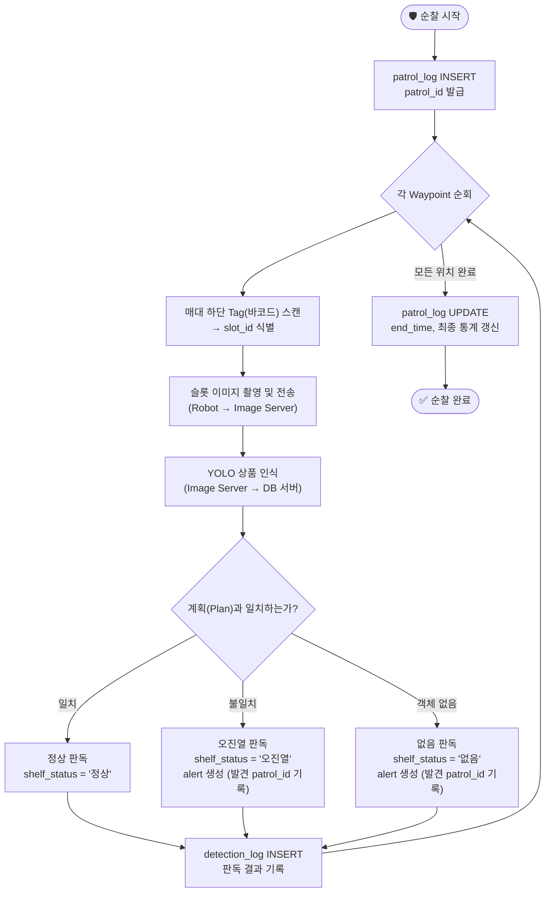

# 🔄 순찰 판독 및 상태 업데이트 로직 (Plan vs. Reality)

> **연관 파일:** [`erd.md`](./erd.md) | [`create_tables.sql`](./create_tables.sql)  
> **작성일:** 2026-03-27

---

## 1. 개요

본 시스템은 **"계획된 진열 정보(Plan)"**와 **"로봇이 실제로 본 정보(Reality)"**를 비교하여 상태를 판독합니다.
더 이상 순회 중 자동으로 새로운 슬롯을 등록하거나 바코드를 DB에 추가하지 않습니다 (정적 계획 기반).

---

## 2. 전체 흐름도



---

## 3. 웹 서버 처리 로직 (Python 의사코드)

```python
def process_scan_result(patrol_id, slot_id, detected_product_id):
    """
    이미지 서버에서 YOLO 인식 결과를 보냈을 때 호출됨
    """
    # 1. 해당 슬롯의 진열 계획 가져오기
    plan = db.query("SELECT product_id FROM waypoint_product_plan WHERE slot_id = %s", slot_id)
    
    # 2. 판독 결과 결정
    if detected_product_id == plan.product_id:
        result_status = '정상'
    elif detected_product_id is None:
        result_status = '없음'
        # 알람 생성 시 발견된 순찰 회차(patrol_id)를 함께 기록
        db.insert_alert(patrol_id=patrol_id, slot_id=slot_id, alert_type='없음', 
                        msg="상품이 진열되어 있지 않습니다.")
    else:
        result_status = '오진열'
        # 알람 생성 시 발견된 순찰 회차(patrol_id)를 함께 기록
        db.insert_alert(patrol_id=patrol_id, slot_id=slot_id, alert_type='오진열', 
                        actual_id=detected_product_id, 
                        msg=f"계획({plan.product_id})과 다른 상품({detected_product_id}) 발견")

    # 3. 실시간 현황(shelf_status) 업데이트
    db.update_shelf_status(slot_id, status=result_status, product_id=detected_product_id)

    # 4. 판독 이력(detection_log) 기록
    db.insert_detection_log(
        patrol_id=patrol_id,
        slot_id=slot_id,
        product_id=detected_product_id,
        result=result_status
    )
```

---

## 4. 용어 정의

- **정상 (Normal)**: `waypoint_product_plan`에 정의된 `product_id`와 이미지 서버가 반환한 `product_id`가 동일함.
- **없음 (Empty)**: 이미지 서버가 해당 슬롯 위치에서 어떤 상품 객체도 발견하지 못함. (창고 재고 여부와는 별개)
- **오진열 (Misplaced)**: 이미지 서버가 상품을 인식했으나, `waypoint_product_plan`에 지정된 상품과 다른 경우.

---

## 5. 변경 사항 (v3.3)
- **알람 추적성 강화**: `alert` 테이블에 `patrol_id` 컬럼을 추가하여, 해당 문제가 "어느 순찰 회차"에서 처음 발견되었는지 즉시 파악 가능하도록 개선.
- **자동 등록 폐지**: `slot_history` 테이블 삭제 유지.
