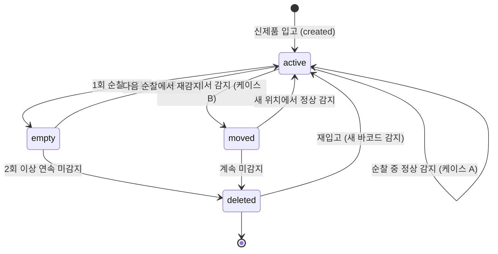

# 🔄 슬롯 자동 업데이트 로직

> **연관 파일:** [`erd.md`](./erd.md) | [`create_tables.sql`](./create_tables.sql)  
> **작성일:** 2026-03-24  

---

## 개요

순찰(patrol) 중 바코드를 감지할 때마다 **슬롯(slot) 상태를 자동으로 업데이트**합니다.  
회사 정책으로 상품이 이동/추가/제거되더라도 다음 순찰에서 자동으로 DB가 최신화됩니다.

---

## 전체 흐름도

```mermaid
flowchart TD
    A(["&#x1F6E1; 순찰 시작"]) --> B["patrol_log INSERT\npatrol_id 발급"]
    B --> C{"각 waypoint 순회"}
    C --> D["이미지 촬영 및 전송\n(Robot → Image Server)"]
    D --> E["상품 바코드/객체 판독\n(Image Server → DB)"]
    E --> F{"DB에 있는가?"}

    F -- "없음 (신규)" --> G["slot INSERT\nslot_history: created"]
    F -- "있음" --> H{"위치가 다른가?"}

    H -- "같은 위치" --> I["케이스 A\nslot.status = active\nodom_x/y 갱신"]
    H -- "다른 위치" --> J["케이스 B\nslot.status = moved\nodom 갱신\nslot_history: moved\nalert: 슬롯변경"]

    G --> K["detection_log INSERT\npatrol_id 포함"]
    I --> K
    J --> K
    K --> C

    C -- "순찰 완료" --> L["미감지 슬롯 탐색\nactive AND NOT IN 이번 patrol detection"]
    L --> M{"미감지 횟수?"}

    M -- "1회" --> N["slot.status = empty\nalert: 재고부족"]
    M -- "2회 이상" --> O["slot.status = deleted\nslot_history: deleted\nalert: 없음"]

    N --> P["patrol_log UPDATE\nend_time, status=완료\nnew/moved/missing 집계"]
    O --> P
    P --> Q(["&#x2705; 순찰 완료"])
```



---

## 웹 서버 처리 로직 (Python 의사코드)

```python
def process_patrol_complete(patrol_id):
    """순찰 완료 시 호출 — 슬롯 자동 업데이트"""

    # 1. 이번 순찰에서 감지된 slot_id 목록
    scanned_slots = db.query("""
        SELECT DISTINCT slot_id FROM detection_log
        WHERE patrol_id = %s AND slot_id IS NOT NULL
    """, patrol_id)

    # 2. 이전까지 active 상태였던 모든 슬롯
    active_slots = db.query("""
        SELECT slot_id FROM slot WHERE status = 'active'
    """)

    # 3. 이번 순찰에서 못 본 슬롯 (Plan에 있었으나 Reality에 없는 경우)
    missing = set(active_slots) - set(scanned_slots)

    for slot_id in missing:
        slot = db.get_slot(slot_id)
        # miss_count는 slot 테이블에 존재하며, 순찰 완료 시마다 1씩 증가
        # (이 의사코드에서는 miss_count 갱신 로직은 생략)

        if slot.miss_count >= 1:
            # 2회 이상 미감지 → 삭제 처리
            db.update_slot(slot_id, status='deleted')
            db.insert_alert(slot_id, alert_type='없음')
        else:
            # 1회 미감지 → 빈자리 처리
            db.update_slot(slot_id, status='empty')
            db.insert_alert(slot_id, alert_type='재고부족')

    # 4. 신규/이동 슬롯 집계 → patrol_log 업데이트
    db.update_patrol_log(patrol_id,
        end_time=now(),
        status='완료',
        new_slots=count_new,
        moved_slots=count_moved,
        missing_slots=len(missing)
    )


def process_barcode_detection(patrol_id, barcode, odom_x, odom_y, shelf_id):
    """바코드 감지 시 호출 — 슬롯 생성/업데이트"""

    existing_slot = db.find_slot_by_barcode(barcode)

    if existing_slot is None:
        # 케이스 C: 신규 슬롯
        slot_id = db.insert_slot(
            shelf_id=shelf_id, barcode=barcode,
            odom_x=odom_x, odom_y=odom_y, status='active'
        )
        db.insert_slot_history(slot_id, change_type='created')

    elif is_different_position(existing_slot, odom_x, odom_y):
        # 케이스 B: 위치 이동
        db.insert_slot_history(existing_slot.slot_id, change_type='moved',
            old_odom_x=existing_slot.odom_x, old_odom_y=existing_slot.odom_y)
        db.update_slot(existing_slot.slot_id,
            odom_x=odom_x, odom_y=odom_y, status='moved')
        db.insert_alert(existing_slot.slot_id, alert_type='슬롯변경')
    else:
        # 케이스 A: 정상 감지 (동일 위치)
        db.update_slot(existing_slot.slot_id, status='active',
            odom_x=odom_x, odom_y=odom_y)

    # detection_log 항상 기록
    db.insert_detection_log(patrol_id=patrol_id, slot_id=slot_id, ...)
```

---

## 슬롯 상태 전이 다이어그램



---

## 연속 미감지 판단 기준 (권장)

| 연속 미감지 순찰 수 | 처리 |
|---|---|
| 0회 | `active` 유지 |
| 1회 | `empty` → `alert: 재고부족` |
| 2회 이상 | `deleted` → `alert: 없음` |

> 💡 이 기준은 순찰 주기에 따라 조정 필요  
> (예: 10분 단위 순찰이면 2회 = 20분 이상 미감지)

---

## 관련 파일

| 파일 | 내용 |
|---|---|
| [`erd.md`](./erd.md) | ERD 다이어그램 |
| [`create_tables.sql`](./create_tables.sql) | 테이블 생성 SQL |
| [`how_to_view_erd.md`](./how_to_view_erd.md) | ERD 보는 법 |
| [`slot_update_logic.md`](./slot_update_logic.md) | 이 파일 |
