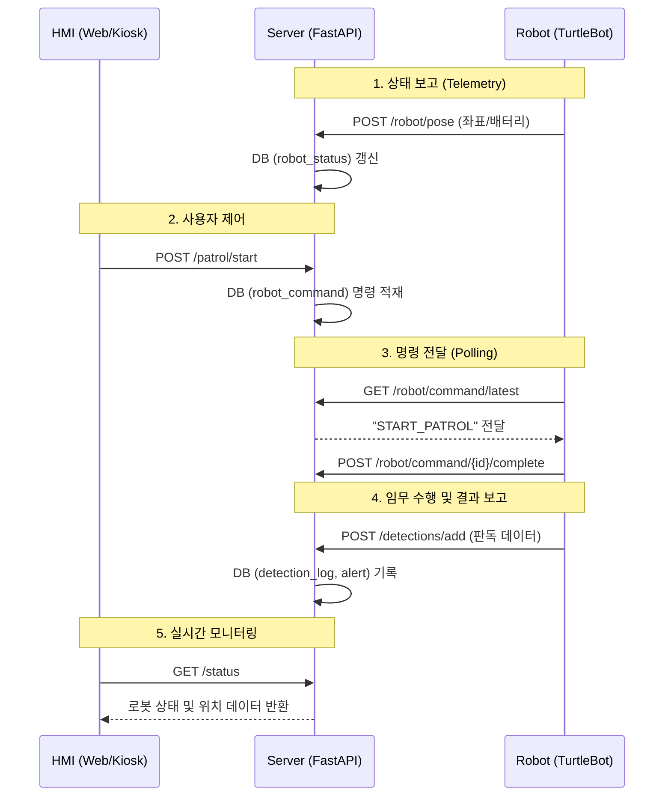

# 🤖 Gilbot 시스템 통신 통합 가이드: 백엔드 원리부터 로봇 구현까지

이 문서는 FastAPI의 데코레이터 원리와 로봇에서 서버로 인지 데이터를 전송하는 전체 과정을 다룹니다.

---

## 1. 백엔드 이해: 데코레이터(`@`)의 마법

`main.py` 파일에서 `@router.post("/detections/add")`와 같은 코드를 보셨을 것입니다. 여기서 `@` 기호가 왜 그토록 중요한지 기초부터 자세히 설명합니다.

### 🌟 데코레이터(Decorator)의 기초 개념
데코레이터는 말 그대로 **"함수를 장식해 주는 도구"**입니다. 파이썬에서 함수는 일련의 명령을 수행하는 상자인데, 이 상자 위에 특수한 기능을 가진 포장지를 덮어씌운다고 생각하면 됩니다.

*   **원본 함수**: "나는 상품 정보를 받아서 DB에 저장하는 일만 할 거야."
*   **데코레이터(@)**: "너는 이제 인터넷 주소(URL)와 연결되었어! 누군가 이 주소로 데이터를 보내면 너를 실행시켜 줄게."

### 🔌 FastAPI에서 `@router`를 쓰는 이유 3가지
1.  **맵핑(Mapping)**: 단순한 파이썬 함수를 웹 서비스용 **통로(Endpoint)**로 변환합니다. `@router.post("/abc")`라고 쓰면 "이 시스템의 `/abc` 주소는 이 함수가 담당한다"는 강력한 선언입니다.
2.  **데이터 규격 필터링**: 데코레이터는 입력받는 데이터가 약속된 형식(`DetectionInput`)을 지키는지 입구에서 검사합니다. 형식이 안 맞으면 함수 내부로 들어오지도 못하게 차단하여 서버 오류를 방지합니다.
3.  **인프라와 로직의 분리**: 개발자는 '인터넷 통신이 어떻게 이루어지는지' 고민할 필요 없이, 함수 내부의 '비즈니스 로직(DB 저장, 판독 등)'에만 집중할 수 있게 해줍니다.

---

## 2. 로봇 구현: API 호출 전체 소스 코드

로봇이나 제어 환경에서 서버로 데이터를 전송하기 위한 완전한 파이썬 코드입니다. 이 코드를 복사하여 바로 사용하거나 ROS2 노드에 통합할 수 있습니다.

```python
import requests
import json
from datetime import datetime

# --- 설정 사항 ---
# 서버의 실제 주소 (환경에 맞게 수정하세요)
BASE_URL = "http://16.184.56.119/api"  
API_ENDPOINT = f"{BASE_URL}/detections/add"

def send_detection_event(
    tag_barcode: str, 
    detected_barcode: str = None, 
    yolo_class_id: int = None, 
    confidence: float = 1.0, 
    odom_x: float = 0.0, 
    odom_y: float = 0.0
):
    """
    로봇에서 감지된 정보를 백엔드 서버의 /detections/add 로 전송합니다.
    """
    # 1. 서버가 요구하는 규격(DetectionInput)에 맞춰 데이터 포장
    payload = {
        "tag_barcode": tag_barcode,         # 매대 위치 태그
        "detected_barcode": detected_barcode, # 인식한 상품 바코드
        "yolo_class_id": yolo_class_id,       # 시각 지능(YOLO) 결과 ID
        "confidence": confidence,             # 신뢰도 (0~1)
        "odom_x": odom_x,                     # 현재 로봇 X 좌표
        "odom_y": odom_y,                     # 현재 로봇 Y 좌표
        "timestamp": datetime.now().isoformat() # 현재 시각
    }

    try:
        # 2. HTTP POST 방식으로 데이터 전송
        response = requests.post(API_ENDPOINT, json=payload, timeout=5)
        
        # 3. 결과 확인
        if response.status_code == 200:
            result = response.json()
            print(f"✅ 판정 결과: {result['judgment']} (위치: {result['location']})")
            return result
        else:
            print(f"❌ 전송 실패: {response.status_code}")
            return None
    except Exception as e:
        print(f"🚨 통신 오류: {e}")
        return None

# --- 실행 예시 ---
if __name__ == "__main__":
    # 위치 태그 'T01'에서 바코드 인식을 성공했을 때 전송 예시
    send_detection_event(
        tag_barcode="T01", 
        detected_barcode="880123456789", 
        odom_x=1.2, 
        odom_y=0.5
    )
```

---

## 3. 코드 상세 설명 (왜 이렇게 짰나요?)

### 📦 데이터 규격 (Payload)
서버의 `main.py`에 정의된 `DetectionInput` 모델과 100% 일치해야 합니다.
- **tag_barcode**: 로봇이 현재 어느 매대 앞에 있는지 알려주는 식별자입니다. 서버는 이 값을 기반으로 무엇이 진열되어 있어야 하는지 계획(Plan)을 찾습니다.
- **yolo_class_id**: 바코드를 물리적으로 읽지 못했더라도 AI 모델이 인식한 클래스 번호만 보내면 서버가 상품 마스터 DB를 뒤져서 어떤 상품인지 매칭해줍니다.
- **timestamp**: 로봇 센싱 시점과 서버 도달 시점의 차이를 추적하고, 정확한 시간대별 로그를 남기기 위해 필수적입니다.

### 📡 통신 도구 (`requests.post`)
- **POST 방식**: 서버의 상태를 변경(데이터 추가, DB 업데이트)할 때 사용하는 HTTP 메서드입니다.
- **JSON 직렬화**: 파이썬 객체를 웹에서 통용되는 JSON 스트링으로 변환하여 데이터 유실 없이 전송합니다.

### 🛡️ 예외 처리 (`try-except`)
- 작업 현장에서 네트워크 불안정으로 인한 **Request Exception**이 발생해도 로봇 제어 프로세스 전체가 죽지 않도록 방어적인 코드를 작성했습니다.

---

## 4. 최종 요약 흐름도

1.  **로봇(Client)**: 센서 감지 -> `send_detection_event` 가동 -> 데이터 패키징.
2.  **네트워크**: HTTP POST 요청이 설정된 서버 주소로 전송.
3.  **서버(FastAPI)**: `@router.post` 데코레이터가 요청을 수신하여 담당 함수로 배정.
4.  **판독(Logic)**: 서버가 DB와 대조하여 '정상/결품/오진열' 판정 후 DB 저장.
5.  **응답(Response)**: 판정 결과와 위치 정보를 로봇에게 리턴.

---

## 5. 로봇 텔레메트리 연동: 실시간 상태 전송

로봇은 인식 작업 외에도 자신의 위치와 배터리 상태를 주기적으로 서버에 보고해야 합니다. 이 데이터는 HMI 대시보드에서 로봇의 '살아있음'과 '현재 위치'를 시각화하는 데 쓰입니다.

### 📍 위치 정보 업데이트 (`/robot/pose`)
로봇의 주행 오도메트리(Odometry) 정보를 서버에 전송합니다. (권장 간격: 1~2초)

```python
# odom_x, odom_y는 로봇 좌표계 기준
requests.post(f"{BASE_URL}/robot/pose", json={"odom_x": 1.52, "odom_y": -0.85})
```

### 🔋 배터리 상태 업데이트 (`/robot/battery`)
로봇의 배터리 잔량을 업데이트합니다.

```python
requests.post(f"{BASE_URL}/robot/battery", json={"percentage": 85.5})
```

---

## 6. 하향식 명령 처리 (Command Polling)

사용자가 HMI에서 'START'나 'STOP' 버튼을 누르면 서버 DB에 명령이 쌓입니다. 로봇은 이 명령을 **가져가서(Fetch)** 실행해야 합니다.

### 📥 최신 명령 확인 (`/robot/command/latest`)

```python
def fetch_and_execute_command():
    response = requests.get(f"{BASE_URL}/robot/command/latest")
    if response.status_code == 200:
        cmd = response.json()
        cmd_type = cmd.get("command_type")
        
        if cmd_type == "START_PATROL":
            print("🚀 순찰 시작 명령 수신!")
            # 순찰 로직 가동...
            mark_command_complete(cmd["command_id"])
        elif cmd_type == "EMERGENCY_STOP":
            print("🛑 비상 정지 명령 수신!")
            # 즉시 정지 로직...
            mark_command_complete(cmd["command_id"])

def mark_command_complete(cmd_id):
    # 명령 수행 완료 보고 (이걸 안 하면 서버는 계속 PENDING으로 인식)
    requests.post(f"{BASE_URL}/robot/command/{cmd_id}/complete")
```

---

## 7. HMI 모니터링 원리 (`/status`)

시스템의 전체 상태를 한눈에 파악하는 '마스터 API'입니다. HMI 웹페이지는 이 API를 1초마다 호출하여 화면을 갱신합니다.

- **상태값**: `online` (로봇 하트비트 확인됨), `offline` (통신 단절).
- **로봇 동작**: `순찰중`, `휴식중`, `비상정지`, `복귀중`.
- **통합 데이터**: 현재 좌표, 배터리, 최신 명령, 서버 시간 등을 모두 포함합니다.

---

## 8. 전체 시스템 데이터 흐름도

Gilbot 시스템의 각 구성 요소가 어떻게 맞물려 돌아가는지 요약합니다.



---
*문서 최종 수정일: 2026-04-09 (v1.1)*
