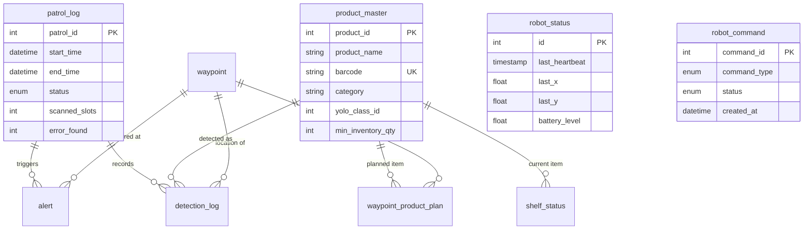

# Gilbot 시스템 아키텍처 및 사용 매뉴얼

이 문서는 스마트 편의점 진열 관리 로봇(Gilbot) 프로젝트의 전체 시스템 구조와 사용 방법, 그리고 데이터베이스 설계 및 기술 스택을 상세히 설명합니다.

---

## 1. 시스템 개요 (System Overview)

Gilbot 시스템은 편의점 내 매대 관리를 자동화하기 위해 설계된 로봇 시스템입니다. 로봇이 매대를 주행하며 상품의 상태(정상, 결품, 오진열)를 실시간으로 판독하고, 이를 중앙 서버에 기록하여 관리자가 HMI(Human-Machine Interface)를 통해 모니터링 및 제어할 수 있도록 합니다.

### 핵심 목표
- **실시간 모니터링**: 로봇의 위치, 배터리 상태, 순찰 진행 상황 확인.
- **자동 판독**: 비전 인식을 통한 진열 상태 데이터베이스 기록.
- **원격 제어**: 순찰 시작, 복귀, 비상 정지 등 로봇 명령 수행.

---

## 2. AWS Lightsail 인프라 구성 (AWS Lightsail Infrastructure)

시스템의 심장 역할을 하는 서버는 **AWS Lightsail** 인스턴스에 배포되어 있습니다.

### 네트워크 구성
- **고정 IP (Static IP)**: `16.184.56.119`
- **주요 개방 포트**:
  - `80/443`: HTTP/HTTPS (HMI 웹 접속)
  - `8000`: FastAPI 백엔드 (로봇 데이터 수신 및 API)
  - `3306`: MySQL 데이터베이스 (원격 DB 접속)
  - `22`: SSH (서버 관리용)

### 서버 스택
- **OS**: Ubuntu Linux
- **Reverse Proxy**: Apache2 (`gilbot.conf`)
  - 외부 80번 포트 요청을 로컬 8000번 포트의 FastAPI로 중계.
- **Backend API**: FastAPI (Python 3.9+)
- **Database**: MySQL 8.0+

### 사용 매뉴얼 (Usage Manual)
1. **웹 접속**: 브라우저에서 `http://16.184.56.119/hmi` 또는 프록시 설정에 따른 URL로 접속합니다.
2. **실시간 모니터링**: 메인 대시보드에서 로봇의 현재 좌표(X, Y)와 배터리 잔량을 확인합니다.
3. **명령 제어**:
   - `START`: 순찰을 시작합니다.
   - `STOP`: 진행 중인 순찰을 즉시 중단합니다 (비상 정지).
   - `RETURN`: 기지로 로봇을 복귀시킵니다.
   - `영상/음성`: 로봇의 실시간 비전 데이터나 음성 기능을 활성화합니다.

---

## 3. 데이터베이스 설계 (Database Architecture)

시스템의 데이터는 MySQL 데이터베이스(`gilbot`)에 저장됩니다.

### ERD (Entity Relationship Diagram)



### 테이블 목록 (Table List)

| 테이블명 | 설명 | 비고 |
| :--- | :--- | :--- |
| `robot_status` | 로봇의 실시간 좌표, 배터리, 하트비트 데이터 관리 | ID=1 단일 행 관리 |
| `patrol_log` | 순찰 회차별 시작/종료 시간 및 통계(스캔 수, 에러 발견 수) 기록 | |
| `product_master` | 상품 정보(이름, 바코드, 카테고리, YOLO 클래스 ID) 관리 | |
| `robot_command` | 로봇에게 전달되는 제어 명령 큐(Queue) | PENDING/COMPLETED 상태 관리 |
| `waypoint` | 로봇이 방문할 지점의 좌표 및 순서 정보 | |
| `waypoint_product_plan` | 특정 Waypoint에 진열되어야 할 상품 계획(바코드 태그 포함) | |
| `detection_log` | 인식된 모든 상품의 개별 이력 및 결과(정상/결품/오진열) | |
| `shelf_status` | 현재 매대의 실제 진열 현황 (Last Known State) | |
| `alert` | 오진열이나 결품 발견 시 생성되는 알람 데이터 | |
| `patrol_config` | 순찰 간격, 시간대 등 시스템 설정값 | |

---

## 4. 백엔드 구성 (Backend Configuration)

백엔드는 **FastAPI** 프레임워크를 기반으로 하며, 비동기 처리를 통해 로봇의 빠른 데이터 업데이트를 지원합니다.

### 주요 역할
- **로봇 데이터 수신**: `/robot/pose`, `/robot/battery` 등의 엔드포인트를 통해 상태 갱신.
- **인식 결과 판독**: 로봇이 보낸 YOLO 클래스/바코드 데이터를 수신하여 `product_master`와 비교 후 `detection_log` 기록.
- **명령 큐 관리**: HMI 요청을 `robot_command` 테이블에 적재하고 로봇이 이를 순차적으로 가져가도록 처리.

### 단계별 배포 가이드 (Step-by-step Deployment Guide)

1. **필수 패키지 설치**:
   ```bash
   pip install fastapi uvicorn mysql-connector-python python-dotenv
   ```
2. **환경 변수 설정**: `.env` 파일을 생성하고 DB 정보를 입력합니다.
   ```env
   DB_MODE=remote
   REMOTE_DB_HOST=16.184.56.119
   REMOTE_DB_USER=gilbot
   REMOTE_DB_PASSWORD=robot123
   REMOTE_DB_NAME=gilbot
   ```
3. **서버 실행**:
   ```bash
   nohup python3 main.py > server.log 2>&1 &
   ```
4. **Apache 리버스 프록시 설정**:
   - `/etc/apache2/sites-enabled/gilbot.conf` 파일에서 80번 포트 요청을 `http://localhost:8000`으로 ProxyPass 설정.

---

## 5. 프론트엔드 구성 (Frontend Configuration)

HMI(Human-Machine Interface)는 로봇의 관리자 페이지 역할을 하며, 정적 파일(`index.html`, `style.css`, `app.js`)로 구성됩니다.

### 기술 스택
- **HTML5/CSS3**: Glassmorphism 디자인 적용 (반투명 서리 유리 효과).
- **Vanilla JavaScript**: 외부 라이브러리 의존성을 최소화하고 `fetch API`를 이용한 실시간 폴링(Polling) 구현.
- **FontAwesome**: 아이콘 시각화.

### 특징
- **반응형 레이아웃**: 태블릿 및 키오스크 화면에 최적화된 800x480 고정 레이아웃.
- **상태 전이**: 로봇의 상태(순찰중, 비상정지, 복귀중)에 따라 버튼 색상 및 활성화 여부가 동적으로 변경.
- **비디오 스트리밍**: 특정 명령 시 로봇의 카메라 피드를 오버레이 형태로 출력.

---
*문서 작성일: 2026-04-08*
